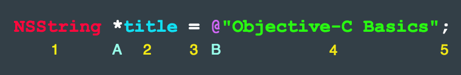

# Learning Objective-C

## Table of Contents
<!-- START doctoc generated TOC please keep comment here to allow auto update -->
<!-- DON'T EDIT THIS SECTION, INSTEAD RE-RUN doctoc TO UPDATE -->


- [Fundamental Concepts](#fundamental-concepts)
  - [Square Brackets](#square-brackets)
  - [Memory Management](#memory-management)
  - [Variables](#variables)
    - [The `*` - Asterisk](#the----asterisk)
    - [The `@` - At Symbol](#the----at-symbol)
  - [Constants](#constants)
  - [File Extensions](#file-extensions)
- [Types](#types)
  - [Strings](#strings)
  - [Numbers](#numbers)
  - [Dictionaries](#dictionaries)
- [References](#references)

<!-- END doctoc generated TOC please keep comment here to allow auto update -->


## Fundamental Concepts

> **`Objective-C`** is based on the **`C`** programming language, with lots of object-oriented features added.

### Square Brackets

**`Objective-C`** maintains all the same syntax and features of **`C`**.

```c
// The makeEmpty message is sent to the mug object
mug makeEmpty
```

In **`Objective-C`**, we simply surround such actions with `Square Brackets`:

```objective-c
[mug makeEmpty]
```

### Memory Management

> In iOS 4.0, Apple introduced a concept called **`ARC`**(Automatic Reference Counting) which took much of the mundane pain of memory management away from **`Objective-C`** programming.

Before that, you will see many `retain` and `release` messages passed to objects.

### Variables



#### The `*` - Asterisk

> An operator that is used to **`de-reference`** a pointer. 

- **`Pointers`** point to a location in memory where the actual data is stored.
- **`De-reference`** a pointer means that we obtain the value stored in the memory where the pointer is pointing to.

The following are all equivalent:

```objective-c
NSString* title;
NSString * title; 
NSString *title;
```

#### The `@` - At Symbol

> A way to signal that whatever it is attached to is special to **`Objective-C`** and not part of regular **`C`**. 

- **`@`** plus **`Text`** inside **`Double Quotes`** make up an **`NSString Literal`**.

### Constants

### File Extensions
* **`.h`** (header): declarations and object interfaces
* **`.m`** (method): definitions and object implementations


## Types

### Strings

```objective-c
NSString *product = @"Bouncy Balls";
NSLog(@"%@", product);
```

```objective-c
NSString *product = [NSString stringWithUTF8String:"Bouncy Balls"];
NSLog(@"%@", product);
```

```objective-c
char greeting[] = "Howdy, Folks!";
NSLog(@"%s", greeting);
```

### Numbers

```objective-c
int quantity = 144;
NSLog(@"%d", quantity);
```

```objective-c
float price = 19.99;
NSLog(@"%f", price);
```

```objective-c
double unitPrice = price / quantity;
NSLog(@"%f", unitPrice);
```

```objective-c
NSNumber *unitPriceObject = [NSNumber numberWithDouble:unitPrice];
NSLog(@"%@", unitPriceObject);
NSLog(@"%f", [unitPriceObject doubleValue]);
```

```objective-c
NSNumber *unitPriceObject = @(unitPrice);
```

```objective-c
NSArray *unitPriceArray = @[@(unitPrice)];
NSLog(@"%@", unitPriceArray);
```

```objective-c
NSString *blurb = [NSString stringWithFormat:
        @"You have selected %@. %@ come in a quantity of %d,"
        " for a price of %.2f and a unit price of %.2f.",
        product, product, quantity, price, unitPrice
];

// You have selected Bouncy Balls.
// Bouncy Balls come in a quantity of 144,
// for a price of 19.99 and a unit price of 0.14.
```

### Dictionaries


## References

- [The Beginner's Guide to Objective-C: Language and Variables](http://blog.teamtreehouse.com/the-beginners-guide-to-objective-c-language-and-variables)
- [Constants in Objective C](https://www.ios-blog.com/tutorials/objective-c/constants-in-objective-c)
- [Objective-C for Swift Developers](https://teamtreehouse.com/library/objectivec-for-swift-developers-2)
