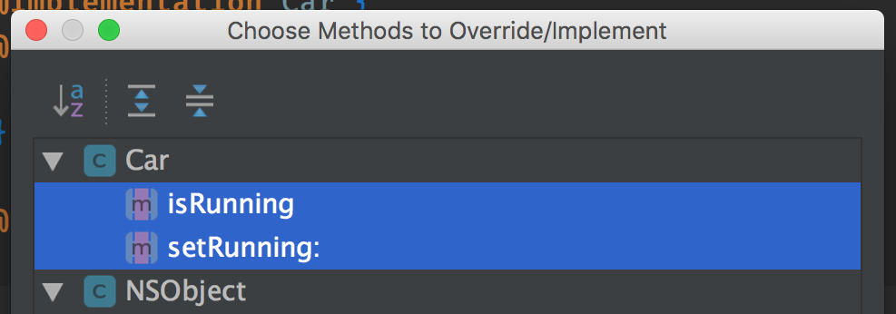

# Learning Objective-C

## Table of Contents
<!-- START doctoc generated TOC please keep comment here to allow auto update -->
<!-- DON'T EDIT THIS SECTION, INSTEAD RE-RUN doctoc TO UPDATE -->


- [Fundamental Concepts](#fundamental-concepts)
  - [Square Brackets](#square-brackets)
  - [Memory Management](#memory-management)
    - [Object Ownership](#object-ownership)
  - [Variables](#variables)
    - [The `*` - Asterisk](#the----asterisk)
    - [The `@` - At Symbol](#the----at-symbol)
  - [For...In Statement](#forin-statement)
  - [File Extensions](#file-extensions)
  - [Imports](#imports)
    - [`#include`](#include)
    - [`#import`](#import)
    - [The `""` - Quoted Form](#the----quoted-form)
    - [The `<>` - Angle-bracket Form](#the----angle-bracket-form)
  - [Classes](#classes)
    - [Defining a Class](#defining-a-class)
    - [Creating an Instance](#creating-an-instance)
    - [Curly Braces](#curly-braces)
  - [Constants](#constants)
    - [Preprocessing Macros](#preprocessing-macros)
    - [Using `const`](#using-const)
- [Types](#types)
  - [Strings](#strings)
  - [Numbers](#numbers)
  - [Dictionaries](#dictionaries)
- [Object Orientation](#object-orientation)
  - [Properties](#properties)
    - [**`@synthesize`**](#synthesize)
    - [Custom Getters / Setters](#custom-getters--setters)
    - [**`readonly`**](#readonly)
    - [**`nonatomic`**](#nonatomic)
    - [**`strong`**](#strong)
    - [**`weak`**](#weak)
    - [**`copy`**](#copy)
  - [Functions](#functions)
  - [Methods](#methods)
- [References](#references)

<!-- END doctoc generated TOC please keep comment here to allow auto update -->


## Fundamental Concepts

> **`Objective-C`** is based on the **`C`** programming language, with lots of object-oriented features added.

### Square Brackets

**`Objective-C`** maintains all the same syntax and features of **`C`**.

```c
// The makeEmpty message is sent to the mug object
mug makeEmpty
```

In **`Objective-C`**, we simply surround such actions with `Square Brackets`:

```objective-c
[mug makeEmpty]
```

### Memory Management

> In iOS 4.0, Apple introduced a concept called **`ARC`**(Automatic Reference Counting) which took much of the mundane pain of memory management away from **`Objective-C`** programming.

Before that, you will see many `retain` and `release` messages passed to objects.

#### Object Ownership


### Variables


#### The `*` - Asterisk

> An operator that is used to **`de-reference`** a pointer. 

- **`Pointers`** point to a location in memory where the actual data is stored.
- **`De-reference`** a pointer means that we obtain the value stored in the memory where the pointer is pointing to.

The following are all equivalent:

```objective-c
NSString* title;
NSString * title; 
NSString *title;
```

#### The `@` - At Symbol

> A way to signal that whatever it is attached to is special to **`Objective-C`** and not part of regular **`C`**. 

- `@"text"`: **NSString Literal**

### For...In Statement

```objective-c
NSArray *names = @[@"Peter", @"David", @"Lawrence"];

for (NSString *name in names) {
    NSLog(@"name = %@", name);
}
```

### File Extensions
* **`.h`** (header): declarations and object interfaces.
* **`.m`** (method): definitions and object implementations.

### Imports

#### `#include`

> Should be used for standard **`C`** stuff.

```objective-c
#include <asl.h>
#include <mach/mach.h>
```

#### `#import`

> Should be used for **`Objective-C`** things.

```objective-c
#import <Foundation/Foundation.h>
```

- Ensures that a file is only ever included once so that we never have a problem with recursive includes.

#### The `""` - Quoted Form

> For `Local Includes`.

```objective-c
// Need to specify the relative path
#import "Car.h"
```

#### The `<>` - Angle-bracket Form

### Classes

#### Defining a Class

```objective-c
// Car.h

#import <Foundation/Foundation.h>

@interface Car : NSObject
@end
```

```objective-c
// Car.m

#import "Car.h"

@implementation Car
@end
```

#### Creating an Instance

> **`new`** does not support custom initializers (e.g. `initWithString`)

```objective-c
Car *car = [Car new];
```

> **`alloc-init`** is more explicit than **`new`**

```objective-c
Car *car = [[Car alloc] init];
```

#### Curly Braces

> Are required to declare **`Instance Variables`**. If you omitted the braces, you would simply be declaring **`Global Variables`**.

```objective-c
@interface Car : NSObject {
	// This block is optional
	NSNumber *id;
}

@end
```

```objective-c
@implementation Car {
	// This block is optional
	NSNumber *id;
}

@end
```

### Constants

#### Preprocessing Macros

> It is called a preprocessing macro because before compile time all the occurrences of **`MAX_NUMBER_OF_ROWS`** will be replaced by the actual value, **`10`** in our case.

```objective-c
// This is not an actual constant
#define MAX_NUMBER_OF_ROWS 10

NSLog(@"MAX_NUMBER_OF_ROWS = %d", MAX_NUMBER_OF_ROWS);
```

#### Using `const`

> More and more people seem to like this approach better.

```objective-c
int const MAX_NUMBER_OF_ROWS = 10;
```

- **`static`**

> Same as `Java` or `JavaScript` definition, the constant will be available in the file only.

```objective-c
// ViewController.m

static NSString *const NAME = @"View Controller";

NSLog(@"NAME = %@", NAME);
```

- **`extern`**

> If you want to have a global constant.

```objective-c
// Car.h

extern NSString *const NAME;
```

```objective-c
// Car.m

NSString *const NAME = @"Mercedes";
```

```objective-c
// ViewController.m

NSLog(@"NAME = %@", NAME);
```


## Types

### Strings

```objective-c
NSString *product = @"Bouncy Balls";
NSLog(@"%@", product);
```

```objective-c
NSString *product = [NSString stringWithUTF8String:"Bouncy Balls"];
NSLog(@"%@", product);
```

```objective-c
char greeting[] = "Howdy, Folks!";
NSLog(@"%s", greeting);
```

### Numbers

```objective-c
int quantity = 144;
NSLog(@"%d", quantity);
```

```objective-c
float price = 19.99;
NSLog(@"%f", price);
```

```objective-c
double unitPrice = price / quantity;
NSLog(@"%f", unitPrice);
```

```objective-c
NSNumber *unitPriceObject = [NSNumber numberWithDouble:unitPrice];
NSLog(@"%@", unitPriceObject);
NSLog(@"%f", [unitPriceObject doubleValue]);
```

```objective-c
NSNumber *unitPriceObject = @(unitPrice);
```

```objective-c
NSArray *unitPriceArray = @[@(unitPrice)];
NSLog(@"%@", unitPriceArray);
```

```objective-c
NSString *blurb = [NSString stringWithFormat:
        @"You have selected %@. %@ come in a quantity of %d,"
        " for a price of %.2f and a unit price of %.2f.",
        product, product, quantity, price, unitPrice
];

// You have selected Bouncy Balls.
// Bouncy Balls come in a quantity of 144,
// for a price of 19.99 and a unit price of 0.14.
```

### Dictionaries

```objective-c
NSDictionary *dictionary = @{
        @"City": @"Boston",
        @"Country": @"USA"
};

NSString *city = [dictionary valueForKey:@"City"];
```

```objective-c
NSMutableDictionary *mutableDictionary = [[NSMutableDictionary alloc] initWithDictionary:dictionary];

[mutableDictionary setValue:@"Brazil" forKey:@"Country"];

[mutableDictionary addEntriesFromDictionary:@{
        @"Population": @(656000)
}];
```


## Object Orientation

### Properties

```objective-c
// Car.h

@property BOOL running;
```

#### **`@synthesize`**

> Tells the compiler to generate the **`getter`** and **`setter`** of a variable.

```objective-c
// Car.m

// Optional - clang compiler from Xcode 4.4+ will be automatically synthesized
@synthesize running = _running;
```

> The compiler will generate `Accessor Methods` for the `running` property, like:

```objective-c
- (BOOL)running {
    return _running;
}

- (void)setRunning:(BOOL)newValue {
    _running = newValue;
}
```

```objective-c
// ViewController.m

Car *honda = [[Car alloc] init];

// Invoke the setter
honda.running = YES;

// Invoke the getter
NSLog(@"honda.running = %d", honda.running);
```

> AppCode generates **`@synthesize`**


```objective-c
@implementation Car {
@private
    BOOL _running;
}

@synthesize running = _running;
@end
```

#### Custom Getters / Setters

```objective-c
@property(getter=isRunning) BOOL running;
```

The generated accessors are now called `isRunning` and `setRunning`.

> AppCode generates `Override Methods`



```objective-c
- (BOOL)isRunning {
    NSLog(@"isRunning is called");
    return _running;
}

- (void)setRunning:(BOOL)running {
    NSLog(@"setRunning is called");
    _running = running;
}
```

#### **`readonly`**

> Do not synthesize a **`setter`** method.

```objective-c
@property(readonly) BOOL running;
```

#### **`nonatomic`**

> Do not guarantee the integrity of `Accessors` in a multi-threaded environment. This is more efficient than the **default** **`atomic`** behavior.

#### **`strong`**

> Create an `Owning Relationship` between the property and the assigned value. This is the **default** for object properties.

#### **`weak`**

> Create a `Non-owning Relationship` between the property and the assigned value. Use this to prevent retain cycles.

#### **`copy`**

> Create a copy of the assigned value instead of referencing the existing instance.

### Functions

### Methods


## References

- [The Beginner's Guide to Objective-C: Language and Variables](http://blog.teamtreehouse.com/the-beginners-guide-to-objective-c-language-and-variables)
- [Learn Swift From Objective-C: Variables, Classes, Methods and Properties](https://codewithchris.com/learn-swift-from-objective-c)
- [Constants in Objective C](https://www.ios-blog.com/tutorials/objective-c/constants-in-objective-c)
- [Objective-C for Swift Developers](https://teamtreehouse.com/library/objectivec-for-swift-developers-2)
- [Properties](http://assets.iosappsdev.org/objective-c/tutorials/objective-c/properties.html)
